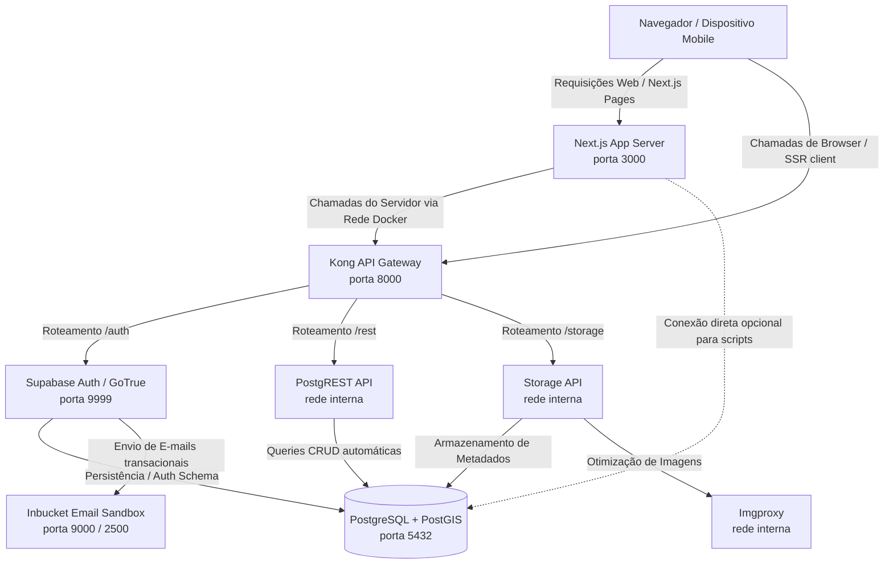

# Guia de Onboarding - PlantMap

Bem-vindo ao repositório do **PlantMap**! Este documento foi preparado para ajudar novos desenvolvedores a entenderem a arquitetura do projeto, a pilha de tecnologia utilizada e a configurar o ambiente de desenvolvimento local de maneira rápida e descomplicada.

---

## 1. Arquitetura do Projeto

O **PlantMap** é uma aplicação mobile-first que utiliza o Next.js no frontend/backend (Server Actions) e delega o restante da infraestrutura (Banco de Dados, Autenticação, REST API e Storage) para serviços locais rodando em containers Docker que espelham o ecossistema do Supabase.

Abaixo está o diagrama simplificado do fluxo de comunicação entre os serviços locais:



---

## 2. Visão Geral dos Serviços no Docker Compose

Diferente de projetos Supabase tradicionais que usam a CLI do Supabase local (`supabase start`), este projeto utiliza uma composição customizada no [docker-compose.yml](./docker-compose.yml). Os seguintes containers são iniciados:

*   **db (PostgreSQL + PostGIS)**: Porta `5432`. Banco de dados relacional com extensões geográficas instaladas.
*   **auth (GoTrue v2.168.0)**: Porta `9999`. Serviço do Supabase responsável pelo gerenciamento de usuários, tokens JWT, login com senha e fluxos OAuth.
*   **migrate (PostgreSQL-Client Alpine)**: Roda temporariamente ao iniciar os containers para executar os scripts SQL contidos em [supabase/migrations/](./supabase/migrations) sequencialmente.
*   **rest (PostgREST v12.2.3)**: Traduz automaticamente o esquema do banco de dados em uma API RESTful consumível.
*   **storage (Supabase Storage API)**: Gerencia o upload e download de arquivos de mídia (como fotos das plantas).
*   **imgproxy**: Utilizado pela Storage API para redimensionamento automático de imagens enviadas pelos usuários.
*   **kong (API Gateway)**: Porta `8000`. Ponto único de entrada que unifica e roteia as chamadas para autenticação, REST e storage, além de validar as chaves `anon` e `service_role`.
*   **inbucket (Email Sandbox)**: Porta `9000` (Web UI) e `2500` (SMTP). Captura os e-mails de confirmação de cadastro enviados pelo GoTrue localmente.
*   **plantmap**: Container Docker da própria aplicação Next.js (utilizado principalmente para fins de deploy local ou validação).

---

## 3. Rede Docker vs Ambiente de Execução (Host)

Uma das maiores fontes de dúvidas de novos desenvolvedores é o mapeamento das variáveis de ambiente no arquivo [.env.local](./.env.local). Temos duas situações de execução:

1.  **Executando no Host (`npm run dev`)**:
    *   O Next.js está rodando na sua máquina física, fora da rede interna do Docker.
    *   A URL do Supabase deve apontar para o gateway unificado (Kong) exposto no host: `http://localhost:8000`.
2.  **Executando dentro do Next.js no Servidor (SSR / Server Actions)**:
    *   Quando o código roda do lado do servidor no Next.js localmente, dependendo da configuração de rede, podemos utilizar `SUPABASE_URL_INTERNAL` apontando para o host de gateway interno.
    *   Em [server.ts](./src/lib/supabase/server.ts), tratamos essa diferença dinamicamente:
        ```typescript
        const supabaseUrl = process.env.SUPABASE_URL_INTERNAL ?? process.env.NEXT_PUBLIC_SUPABASE_URL!
        ```

---

## 4. Manipulação de Dados Geográficos (PostGIS)

O projeto mapeia ocorrências de plantas utilizando coordenadas reais sobre o mapa ([MapLibre GL](https://maplibre.org/)).

### Ordem das Coordenadas no Banco vs Biblioteca de Mapas
> [!IMPORTANT]
> A ordem das coordenadas é uma pegadinha clássica:
> *   **No banco de dados (PostGIS)**, a representação em texto de pontos geográficos (WKT) segue a ordem **`POINT(longitude latitude)`**.
> *   **Em bibliotecas de frontend/APIs do Google Maps/MapLibre**, frequentemente passamos a latitude antes da longitude.
>
> Ao registrar ou atualizar uma ocorrência nas Server Actions ([plants.ts](./src/lib/actions/plants.ts)), a string gerada DEVE seguir a ordem padrão do PostGIS (SRID 4326):
> ```typescript
> location: `SRID=4326;POINT(${data.longitude} ${data.latitude})`
> ```

### O que é EWKB e como decodificamos?
Quando realizamos uma query diretamente na tabela do Supabase sem passar por uma função de formatação (`ST_AsText`), o PostGIS retorna o campo `location` em formato **EWKB (Extended Well-Known Binary)** representado por uma string hexadecimal (ex: `0101000020e6100000...`).

Para evitar a necessidade de bibliotecas pesadas de terceiros para decodificar isso no cliente, criamos uma função auxiliar otimizada chamada `parseEWKBPoint` em [utils.ts](./src/lib/utils.ts) que lê os bytes da string hexadecimal e extrai a latitude e longitude usando arrays binários nativos do JavaScript (`DataView` e `Uint8Array`).

---

## 5. Fluxo de Autenticação Local

A autenticação é gerida via Supabase Auth (GoTrue). A interface do app expõe **apenas login via Google OAuth**
(ver README) — não há formulário de email/senha na UI.

*   **Google OAuth**: no ambiente de desenvolvimento local, requer credenciais reais de um OAuth Client do Google
    configuradas no GoTrue (`GOTRUE_EXTERNAL_GOOGLE_ENABLED`, `GOTRUE_EXTERNAL_GOOGLE_CLIENT_ID`/`SECRET`), que o
    `docker-compose.yml` deste repo não traz por padrão.
*   **Whitelist (`ALLOWED_EMAILS`)**: após o login com Google, o callback (`src/app/auth/callback/route.ts`)
    verifica se o e-mail está na lista `ALLOWED_EMAILS`; se não estiver, a sessão é encerrada e o usuário é
    redirecionado de volta ao login com uma mensagem de erro.
*   **`create-users.ps1` / `create-users.mjs`**: criam usuários com senha diretamente via GoTrue Admin API. Como a
    UI não tem formulário de email/senha, eles não servem para logar no app pelo navegador — use-os para ter
    linhas em `auth.users`/`public.profiles` prontas para testes de banco (ex.: promover um usuário a admin, ver
    Passo 6 abaixo) ou para depurar a API do GoTrue diretamente.
*   **Inbucket (SMTP Sandbox)**: captura localmente qualquer e-mail transacional que o GoTrue dispare (ex.:
    confirmação de cadastro criado via Admin API). Acesse `http://localhost:9000` para visualizar.

---

## 6. Configuração e Inicialização Passo a Passo

Siga os passos abaixo para preparar e executar o projeto no seu ambiente local:

### Passo 1: Pré-requisitos
Certifique-se de ter instalado em sua máquina:
*   [Node.js v20+](https://nodejs.org/)
*   [Docker Desktop](https://www.docker.com/products/docker-desktop/)

### Passo 2: Variáveis de Ambiente
Copie o arquivo de exemplo de variáveis de ambiente para a raiz do seu projeto:
```bash
cp .env.example .env.local
cp .env.example .env
```
Preencha `POSTGRES_PASSWORD`, `JWT_SECRET`, `SUPABASE_ANON_KEY` e `SUPABASE_SERVICE_ROLE_KEY` (usados pelo
`docker-compose.yml`) e `NEXT_PUBLIC_SUPABASE_URL`/`NEXT_PUBLIC_SUPABASE_ANON_KEY` (usados pelo Next.js — geralmente
os mesmos valores de `SUPABASE_ANON_KEY`/`http://localhost:8000`). Deixe `ALLOWED_EMAILS` vazio para permitir
qualquer e-mail localmente, ou liste os e-mails autorizados separados por vírgula.

### Passo 3: Inicializar o Docker
Na raiz do projeto, suba a infraestrutura do Supabase executando:
```bash
docker compose up -d
```
Este comando fará o download das imagens (se for a primeira vez) e inicializará todos os serviços em segundo plano. O container `migrate` rodará as migrations estruturais e os seeds de espécies de plantas do Brasil.

### Passo 4: Criar Usuários de Teste (Opcional)
Registra automaticamente três usuários de teste no GoTrue Admin (ver nota na seção 5 sobre para que servem, já
que a UI só loga via Google). No Windows (PowerShell):
```powershell
.\scripts\create-users.ps1
```
No macOS/Linux (ou Windows com Node instalado):
```bash
node scripts/create-users.mjs
```
*Credenciais criadas:*
*   `ana.botanica@plantmap.test` / Senha: `Plantmap@123`
*   `carlos.verde@plantmap.test` / Senha: `Plantmap@123`
*   `julia.flora@plantmap.test`  / Senha: `Plantmap@123`

### Passo 5: Inicializar o Aplicativo Next.js
Instale as dependências do Node.js e inicie o servidor de desenvolvimento:
```bash
npm install
npm run dev
```
Abra [http://localhost:3000](http://localhost:3000) no seu navegador. O Next.js iniciará o ambiente de desenvolvimento e você poderá visualizar o mapa de plantas em Ribeirão Preto!

### Passo 6: Promover um Usuário a Admin (Opcional)
Donos de ocorrência sempre podem editar/excluir o próprio registro. Para que um usuário edite/exclua registros de
terceiros, ele precisa da flag `is_admin` em `profiles` — que só pode ser definida com acesso direto ao banco
(nunca pela API, ver [migration 012](supabase/migrations/012_ownership_based_permissions.sql)):
```bash
docker compose exec db psql -U postgres -c \
  "update public.profiles set is_admin = true where email = 'seu-email@exemplo.com';"
```

---

## 7. Scripts Úteis e Comandos Comuns

*   **Verificar logs dos containers**:
    ```bash
    docker compose logs -f [nome-do-serviço]
    ```
*   **Resetar banco de dados**:
    Se você bagunçou o banco de dados local e quer recomeçar do zero (reexecutando todas as migrations):
    ```bash
    docker compose down -v
    docker compose up -d
    ```
    *(O parâmetro `-v` garante que o volume de persistência do PostgreSQL seja excluído).*

---

## 8. Lint e Testes

Lint (ESLint, config em `eslint.config.mjs`):
```bash
npm run lint
```

O projeto utiliza **Vitest** + **React Testing Library** para testes unitários. Para executar a suíte de testes:
```bash
npm test
```
Para rodar no modo de escuta (Watch) enquanto altera arquivos:
```bash
npm run test:watch
```

Lint, testes e build rodam automaticamente em push/PR para `master` via
[.github/workflows/ci.yml](.github/workflows/ci.yml).

Se tiver qualquer dúvida, procure o líder técnico ou abra uma issue detalhando o comportamento inesperado encontrado. Bom código!
